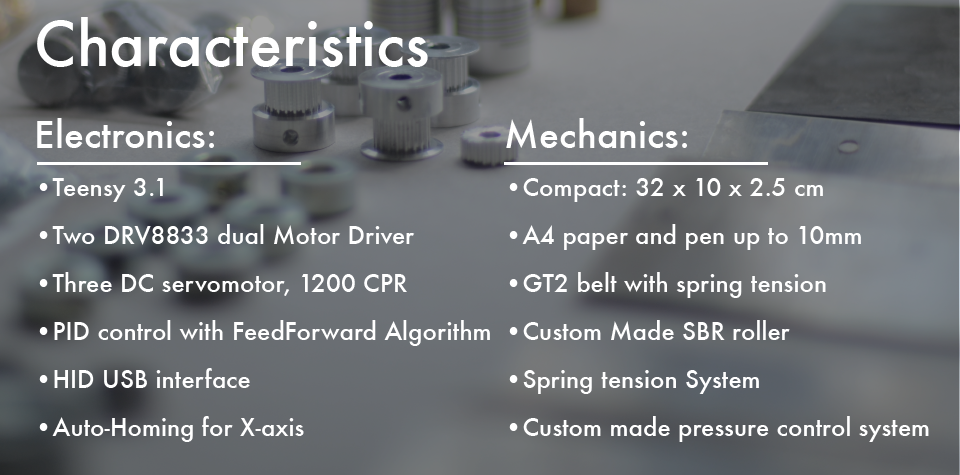
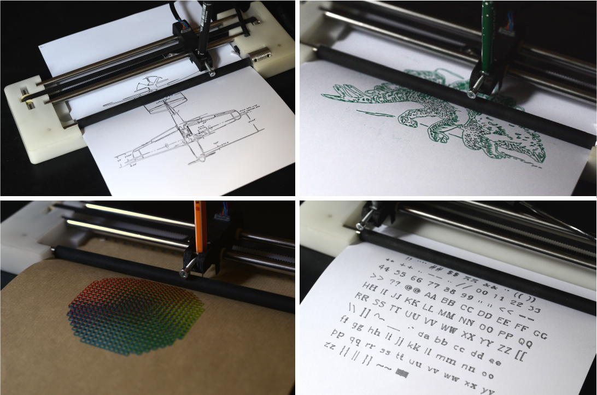
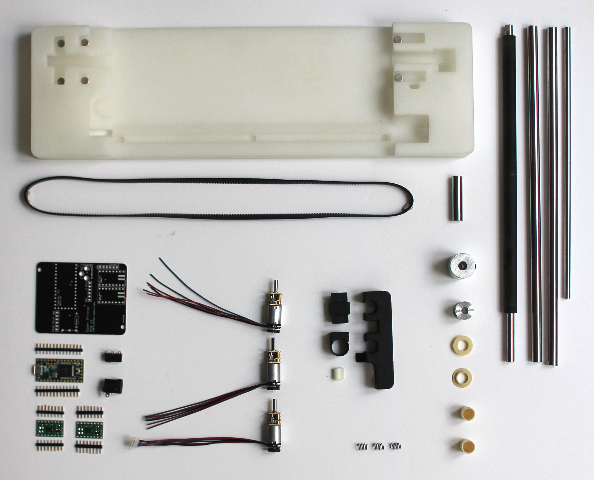

# Liplo V2

An easy-to-assemble and fun-to-use pen plotter.

(click on the gif for the video. Context: this was a video that I made when I wanted to launch a kickstarter. Never went through. Sorry for the bad english/soundwork)

This is the second iteration of my [Liplo](https://github.com/BenjaminPoilve/Liplo) project. Unfortunately, I can't freely share sources, as this project was part of a deal I had with a french organisation call a SATT. Still decided to document the change I have made for this version and why they were better/worse

### Main changes

##### Motor switch

Since one of my main issue with the former model was the overheating of stepper motors, I decided to go with DC motor with hall effect encoder. I had to go over the following steps to make it work:

* Custom coupler for 3mm axis, both for puller and flexible coupler. I had them made by the factory behind robotdigg
* Custom PCB with PID control of the three motors. Used a teensy 3.1 as main component. That allowed me to register the machine as a HID.
* Custom PCB allowed me to fit en endstop for X-axis.
* Use of DC controlled motor, allowed me to make a custom head for pressure control

In the end, I would say this was a bad choice. Though this choice allowed for faster a more precise drawings, those motors are very sensitive, and tend to break for no reason. Add to that that they are really hard to solder, and I understood why stepper are still in use. On the plus side they are cheap ($6 with encoder), fast, and run cool. 

##### Body change

I choose to go from wood to a fully silicon molded body. My main reason:

* I could do away with the pressure plate, that was a pain to manufacture. I found a manufacture for custom roller
* I could press fit motor into the silicon for easy assembly
* It was much cheaper (around $10 per body)

The issue was that people really liked wood! This version did not have the low-tech appeal of the other one. 

##### Other change
 
* I replaced all bearing by Igus plastic bearings. Great choice! Cheap, efficient, small. 

### What happened? 

I was all set up to start an Indiegogo campaign then.. I bailed. I was alone, the motor issue was really worrying me, and the SATT that was supposed to help me was not interested in providing any operational help. I guess sometime, doing things on you own is not the right choice! 

Fell free to contact me if you have any questions! 
